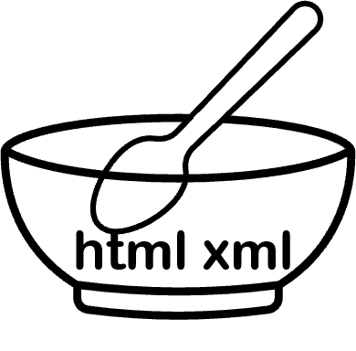

<!-- commented out for now

  

 
-->
haven't finished doing this yet, will continue tomorrow

## me:

 

---

## useful
### languages:

<table border='1'>
  <tr>
    <th>Python</th>
    <th>JS</th>
    <th>TS</th>
  </tr>
  <tr>
    <td align='center'></td>
    <td></td>
    <td></td>
  </tr>
</table>

### frameworks:
<table>
  <tr>
    <th>vitejs</th>
    <th>React</th>
    <th>Django</th>
    <th>Flask</th>
  </tr>
  <tr>
    <td align='center'></td>
    <td align='center'></td>
    <td align='center'></td>
    <td align='center'></td>
  </tr>
</table>

### tools:
<table>
  <tr>
    <th>Git</th>
  </tr>
  <tr>
    <td align='center'></td>
  </tr>
</table>

### libraries:
<table>
  <tr>
    <th>Pandas</th>
    <th>BS</th>
    <th>NumPy</th>
    <th>Matplotlib</th>
    <th>Seaborn</th>
  </tr>
  <tr>
    <td align='center'></td>
    <td align='center'></td>
    <td align='center'></td>
    <td align='center'></td>
    <td align='center'></td>
  </tr>
</table>

other things to add:
- VSCode
- Vim
- Postman
- Jupyer
- SQLite
- MySQL
- Vite
- React
- Django
